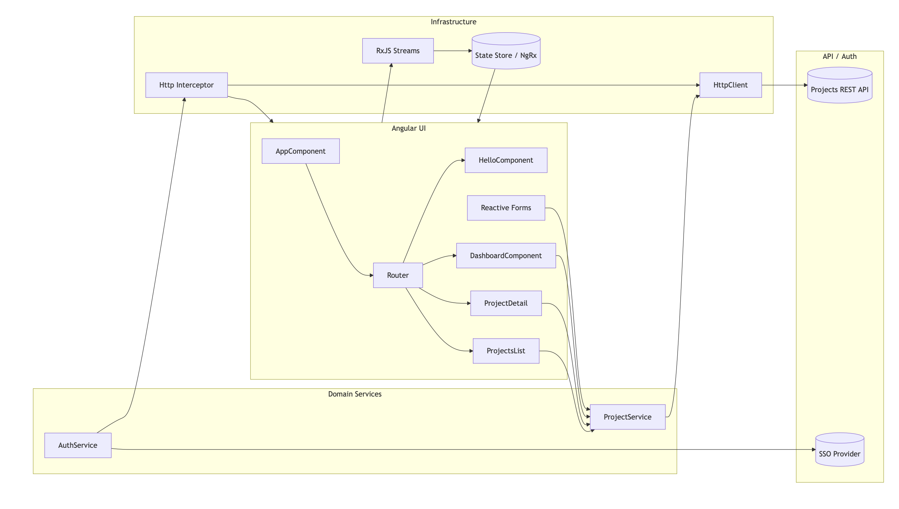
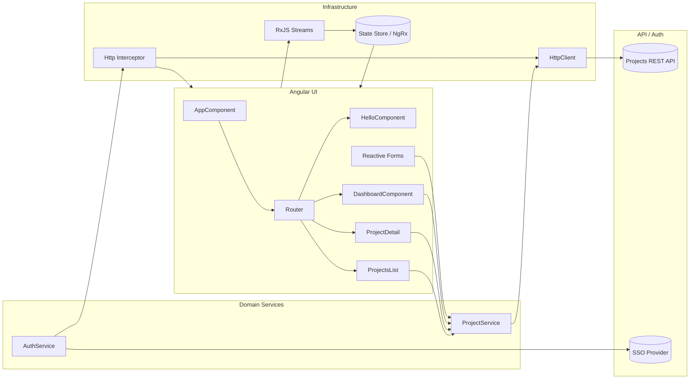

# Project Pulse – Angular 15 Hands-on Curriculum

This repo will host a guided, project-based Angular 15 learning path. We'll build a real app step by step in 1-hour sessions, covering fundamentals to advanced topics like routing, HTTP, authentication (SSO), RxJS, forms, and state management.

## Quick Reference: Git & SSH Commands

### Initial Setup

#### 1. Install Git (macOS)
```bash
# Check if Git is installed
git --version

# Install via Homebrew (if not installed)
brew install git

# Verify installation
git --version
```

#### 2. Install GitHub CLI (optional but recommended)
```bash
# Install via Homebrew
brew install gh

# Verify installation
gh --version
```

#### 3. Configure Git Identity
```bash
# Set your name and email globally
git config --global user.name "Your Name"
git config --global user.email "your.email@example.com"

# Verify configuration
git config --global --list | grep user

# Check current repo config (local)
git config user.name
git config user.email
```

### SSH Setup for GitHub

#### Step 1: Generate SSH Key
```bash
# Generate new SSH key (ed25519 is recommended)
ssh-keygen -t ed25519 -C "your.email@example.com"

# Press Enter to accept default file location (~/.ssh/id_ed25519)
# Enter a passphrase (recommended) or press Enter for none

# For older systems that don't support ed25519, use RSA:
ssh-keygen -t rsa -b 4096 -C "your.email@example.com"
```

#### Step 2: Start SSH Agent
```bash
# Start the SSH agent in the background
eval "$(ssh-agent -s)"

# Should output: Agent pid [number]
```

#### Step 3: Add SSH Key to Agent
```bash
# Add your SSH private key to the ssh-agent
ssh-add ~/.ssh/id_ed25519

# For RSA key:
ssh-add ~/.ssh/id_rsa

# macOS: Add to keychain to persist across reboots
ssh-add --apple-use-keychain ~/.ssh/id_ed25519
```

#### Step 4: Add SSH Key to GitHub
```bash
# Copy public key to clipboard (macOS)
cat ~/.ssh/id_ed25519.pub | pbcopy

# Or display it to copy manually
cat ~/.ssh/id_ed25519.pub

# Then:
# 1. Go to https://github.com/settings/keys
# 2. Click "New SSH key"
# 3. Title: "My MacBook" (or descriptive name)
# 4. Paste the key
# 5. Click "Add SSH key"
```

#### Step 5: Test SSH Connection
```bash
# Test your SSH connection to GitHub
ssh -T git@github.com

# Expected output:
# Hi username! You've successfully authenticated, but GitHub does not provide shell access.
```

#### Step 6: Configure SSH Config (Optional)
```bash
# Create or edit SSH config file
nano ~/.ssh/config

# Add these lines:
Host github.com
  AddKeysToAgent yes
  UseKeychain yes
  IdentityFile ~/.ssh/id_ed25519

# Save and exit (Ctrl+X, Y, Enter)
```

### GitHub CLI Authentication
```bash
# Authenticate with GitHub
gh auth login

# Follow prompts:
# - Choose "GitHub.com"
# - Choose "SSH" 
# - Select your SSH key
# - Authenticate via browser

# Verify authentication
gh auth status
```

### Git Basic Commands
```bash
# Initialize repository
git init

# Check status
git status

# Stage files
git add .
git add <file>

# Commit changes
git commit -m "Your commit message"

# View commit history
git log
git log --oneline

# View changes
git diff
git diff --staged
```

### Git Remote & Push
```bash
# Add remote repository
git remote add origin git@github.com:username/repo.git

# View remotes
git remote -v

# Rename remote
git remote rename old-name new-name

# Remove remote
git remote remove remote-name

# Push to remote
git push -u origin main

# Push all branches
git push --all

# Force push (use with caution)
git push -f origin main
```

### Git Branch Commands
```bash
# Create new branch
git branch feature-name

# Switch to branch
git checkout feature-name
git switch feature-name

# Create and switch in one command
git checkout -b feature-name

# List branches
git branch
git branch -a  # includes remote branches

# Rename current branch
git branch -M new-name

# Delete branch
git branch -d feature-name
git branch -D feature-name  # force delete

# Merge branch
git checkout main
git merge feature-name
```

### Git Pull & Fetch
```bash
# Fetch changes from remote
git fetch origin

# Pull changes (fetch + merge)
git pull origin main

# Pull with rebase
git pull --rebase origin main
```

### Git Stash (Save Work Temporarily)
```bash
# Stash current changes
git stash

# Stash with message
git stash save "work in progress"

# List stashes
git stash list

# Apply most recent stash
git stash apply

# Apply and remove stash
git stash pop

# Clear all stashes
git stash clear
```

### Git Undo Commands
```bash
# Undo last commit (keep changes)
git reset --soft HEAD~1

# Undo last commit (discard changes)
git reset --hard HEAD~1

# Unstage file
git restore --staged <file>

# Discard changes in working directory
git restore <file>

# Revert a commit (creates new commit)
git revert <commit-hash>
```

### GitHub CLI Commands
```bash
# Install GitHub CLI
brew install gh

# Authenticate
gh auth login

# Create repository
gh repo create repo-name --public --source=. --remote=origin --push

# View repository
gh repo view

# Create pull request
gh pr create

# List pull requests
gh pr list

# Clone repository
gh repo clone username/repo
```

### Common Workflows

**Starting a new project:**
```bash
git init
git add .
git commit -m "Initial commit"
gh repo create project-name --public --source=. --remote=origin --push
```

**Daily development:**
```bash
git pull origin main
# ... make changes ...
git add .
git commit -m "Descriptive message"
git push origin main
```

**Feature branch workflow:**
```bash
git checkout -b feature/new-feature
# ... make changes ...
git add .
git commit -m "Add new feature"
git push -u origin feature/new-feature
# Create PR on GitHub
gh pr create
```

**Fix merge conflicts:**
```bash
git pull origin main
# Fix conflicts in files
git add .
git commit -m "Resolve merge conflicts"
git push origin main
```

## Use Case
- Build "Project Pulse": a lightweight project/activity tracker where users can:
  - View a dashboard of projects and activity stream
  - Create and edit projects and tasks
  - Filter/search and paginate lists
  - Authenticate via an SSO provider (mock first, then real)
  - See live updates using RxJS (polling/websocket simulation)

## Architecture Diagram
The following high-level diagram shows major app areas and data flow.

Mermaid code (GitHub renders it; VS Code needs a Mermaid preview extension):



ASCII fallback (renders everywhere):

```
Angular UI
	AppComponent
		└── Router → [Hello, Dashboard, ProjectsList, ProjectDetail]

Services
	ProjectService, AuthService

Infrastructure
	HttpClient ↔ API
	Interceptor → attach auth
	RxJS Streams ↔ UI
	(Optional) NgRx Store ↔ UI

Auth
	AuthService ↔ SSO Provider
```

Tip: In VS Code, install “Markdown Preview Mermaid Support” to render the Mermaid block in the preview. Alternatively, paste the code into https://mermaid.live to verify.

### Feature Breakdown
- Routing: Top-level routes for Dashboard, Projects list, and Project detail; guards/resolvers for protected and preloaded views.
- HTTP: `HttpClient` for REST calls; interceptor attaches auth tokens; error handling and retry strategies.
- Auth/SSO: Mock first, then integrate with a real provider; route protection and login/logout flow.
- RxJS: Streams for search/filter, auto-refresh, and live updates; `async` pipe, core operators, Subjects.
- Forms: Reactive forms for create/edit with validation and UX feedback.
- State: Local service state initially, optional NgRx store/effects for larger-scale management.

## Session Plan (1 hour each)
1. Fundamentals I: Angular app anatomy, components, templates, bindings
	- Outcome: HelloComponent + basic layout
	- Topics: CLI commands, `AppModule`, `AppComponent`, interpolation, property/event binding
	- Task: Create `HelloComponent` and render dynamic message

2. Fundamentals II: Directives, pipes, services, DI
	- Outcome: List rendering with `*ngFor`, conditionals with `*ngIf`, a service providing data
	- Topics: Built-in pipes, custom pipes, providers
	- Task: `ProjectService` returns mock projects; display in a list

3. Routing I: Router setup + feature modules
	- Outcome: App routes for Dashboard and Projects; lazy-loaded feature module
	- Topics: `RouterModule`, route params, navigation
	- Task: Configure routes and add a ProjectsModule

4. HTTP I: Fetching data from REST API
	- Outcome: Use `HttpClient` to load projects; handle loading/error states
	- Topics: `HttpClientModule`, interfaces, typing responses
	- Task: Replace mocks with HTTP calls (use a mock JSON server or in-memory API)

5. RxJS I: Observables, Subjects, operators, async pipe
	- Outcome: Reactive streams for search/filter and auto-refresh
	- Topics: `Observable`, `Subject`, core operators (`map`, `switchMap`, `debounceTime`, `catchError`)
	- Task: Implement search box driving a reactive query

6. Forms I: Template-driven and reactive forms
	- Outcome: Create/edit project form with validation
	- Topics: `FormsModule`, `ReactiveFormsModule`, validators, form state
	- Task: Reactive form for creating a project

7. Routing II: Guards, resolvers, and advanced navigation
	- Outcome: Protect routes, preload data, handle 404
	- Topics: `CanActivate`, `Resolve`, `PreloadingStrategy`
	- Task: Guard edit routes, add resolver for project details

8. Auth (SSO) I: Auth flow (mock), tokens, interceptors
	- Outcome: Login/logout UI; attach auth headers via interceptor
	- Topics: `HttpInterceptor`, route guards, auth service
	- Task: Implement mock SSO and protect routes

9. State Management: Local component state vs service; intro to NgRx (optional)
	- Outcome: Centralized store for projects with effects
	- Topics: NgRx `Store`, `Effects`, selectors, actions
	- Task: Migrate project list to NgRx

10. Performance & UX: Change detection, OnPush, trackBy, lazy loading assets
	 - Outcome: Smooth lists, efficient updates
	 - Topics: `OnPush`, immutability, `trackBy`, bundle analysis

11. Testing: Unit + integration tests
	 - Outcome: Component, service, and route tests
	 - Topics: `TestBed`, `HttpTestingController`, harnesses

12. Deployment & Best Practices
	 - Outcome: Build and deploy (e.g., to Vercel/Netlify), environment config
	 - Topics: `angular.json` configurations, environments, CI basics

## Getting Started
1. Install dependencies
	```bash
	npm install
	```
2. Run the app
	```bash
	npm start
	```
3. Run tests
	```bash
	npm test
	```

## Session 1 – Fundamentals I (Steps)
Follow these steps to implement the first exercise.

1. Generate Hello component (or create manually):
	- File: `src/app/hello/hello.component.ts`
	- Template shows a greeting bound to a component property.

2. Declare component in `AppModule` and add to `AppComponent` template.

3. Add a user input box to change the greeting via event binding.

4. Validate by running `npm start` and confirming updates in the browser.

In the next commit, we'll scaffold the `HelloComponent` and route.

## Development server

Run `ng serve` for a dev server. Navigate to `http://localhost:4200/`. The application will automatically reload if you change any of the source files.

## Code scaffolding

Run `ng generate component component-name` to generate a new component. You can also use `ng generate directive|pipe|service|class|guard|interface|enum|module`.

## Build

Run `ng build` to build the project. The build artifacts will be stored in the `dist/` directory.

## Running unit tests

Run `ng test` to execute the unit tests via [Karma](https://karma-runner.github.io).

## Running end-to-end tests

Run `ng e2e` to execute the end-to-end tests via a platform of your choice. To use this command, you need to first add a package that implements end-to-end testing capabilities.

## Further help

To get more help on the Angular CLI use `ng help` or go check out the [Angular CLI Overview and Command Reference](https://angular.io/cli) page.
